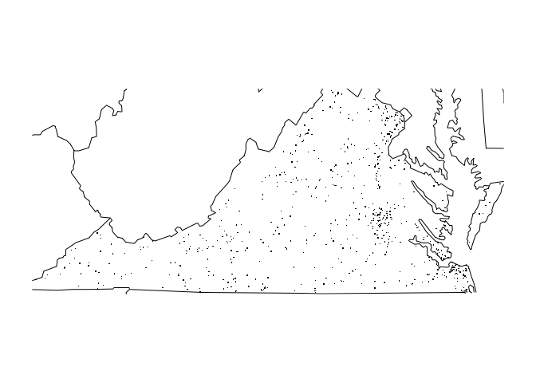

<!-- README.md is generated from README.Rmd. Please edit that file -->
Overview
--------

The functions provided will be using data from the US National Highway Traffic Safety Administration's Fatality Analysis Reporting System, which is a nationwide census providing the American public yearly data regarding fatal injuries suffered in motor vehicle traffic crashes.

Two major functions in this package. `fars_summarize_years` returns a dataframe which summarise the number of accidents during given years. `fars_map_state` draws a map of a given state number and plots locations of the accidents on given years. The remaining functions `make_filename`, `fars_read` and `fars_read_years` are helper functions for the two major functions. `make_filename` return the data file name of an input `year`. `fars_read` reads in data from an input datafile. `fars_read_years` reads in data of a vector of `year` extract the month and year information and store them in a list.

Examples
--------

The numbers of fatal accidents during 2014 is as follows:

``` r
library(dplyr, quietly = TRUE)
#> 
#> Attaching package: 'dplyr'
#> The following objects are masked from 'package:stats':
#> 
#>     filter, lag
#> The following objects are masked from 'package:base':
#> 
#>     intersect, setdiff, setequal, union
Fars::fars_summarize_years(2014)
#> # A tibble: 12 × 2
#>    MONTH `2014`
#> *  <int>  <int>
#> 1      1   2168
#> 2      2   1893
#> 3      3   2245
#> 4      4   2308
#> 5      5   2596
#> 6      6   2583
#> 7      7   2696
#> 8      8   2800
#> 9      9   2618
#> 10    10   2831
#> 11    11   2714
#> 12    12   2604
```

The following call on fars\_map\_state draw a map of state Colorado and plots locations of fatal accidents.

``` r
library(maps)
Fars::fars_map_state(51, 2013)
```



Travis CI 
